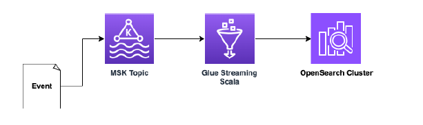

# REAL CASE PROBLEM SPECIFICATION

## Introdução
Foi selecionado uma parte da arquitetura do cliente com o objetivo do candidato ter contato com a stack e desafios antes de seconectar no MAP. Será provido um desenho de arquitetura, uma descrição do resultado esperado e um conjunto de requisitosfuncionais e não funcionais a serem considerados. Ao final, é esperado uma demo feita pelo candidato demonstrando oresultado obtido e todo o código fonte gerado deve fazer parte do entregável.

## Descrição
O candidato deve codificar o máximo que conseguir no tempo provido a seguinte arquitetura:

1. O evento é um lançamento financeiro na conta de um cliente. Por exemplo, um PIX recebido na conta é um tipo delançamento de crédito na conta da pessoa destino do PIX.
2. O evento é publicado em um tópico do MSK para desacoplamento do consumo.
3. O consumo dos eventos é feito através de um Glue Streaming implementado na linguagem Scala e algumas transformaçõesserão necessárias.
4. Os eventos são persistidos em um OpenSearch cluster para futuras consultas.

Toda infraestrutura deve ser criada assim como a parte funcional dos jobs. Toda infra provisionada deve ser feita por algumalinguagem IaC (infra as code) de preferência do desenvolvedor. Ao final, todo código IaC e Glue Job deve ser entregue no diada Demo.

## Requisitos não funcionais
1. O evento publicado no tópico MSK deve estar no formato Avro.
2. O evento persistido no OpenSearch Cluster deve estar no formato Json camelCase.
3. A linguagem utilizada no GlueJob deve ser Scala.
4. O broker MSK pode ser provisionado ou serveless.
5. O cluster OpenSearch pode ser uma instância pequena e pode ser provisionado ou serveless. O domínio pode ser privado(dentro de uma VPC) ou público (com regras de IP para segurança de acesso).
6. A infra do Glue job deve ser feita com IaC e o código ser feito diretamente pelo console da AWS.
7. Toda a infra pode estar em apenas uma AWS Region e tudo dentro de uma mesma AWS Account.

## Requisitos funcionais
1. O Glue Job deve ser capaz de fazer a leitura dos eventos publicados no tópico MSK e fazer a ingestão desse evento noOpenSearch. O evento lido do tópico está em snake_case enquanto que o formato esperado no OpenSearch é um Json comcamelCase, logo uma transformação é esperada nesse Glue Job.

## Desafio Extra
Caso o candidato consiga codificar todo o escopo apresentado anteriormente, segue um escopo adicional que deve sercodificado:
1. Criar um alarme no CloudWatch Alarms para o MSK se o OffsetLag ultrapassar 1000.
2. Criar uma métrica no CloudWatch Metric para o tempo de processamento de cada microbatch
3. Criar um alarme no CloudWatch Alarms se o tempo médio de processamento dos microbatches for maior que 2 segundos.

## Entrega final de Demo
Ao final, o candidato fará uma apresentação do progresso feito e deve entregar um único arquivo Zip com todo o códigodesenvolvido.
Para esse cenário, o prazo será de uma semana. O candidato deve traquear quanto tempo (em horas) foi investido nacodificação da solução e no dia da demo informar esse valor.